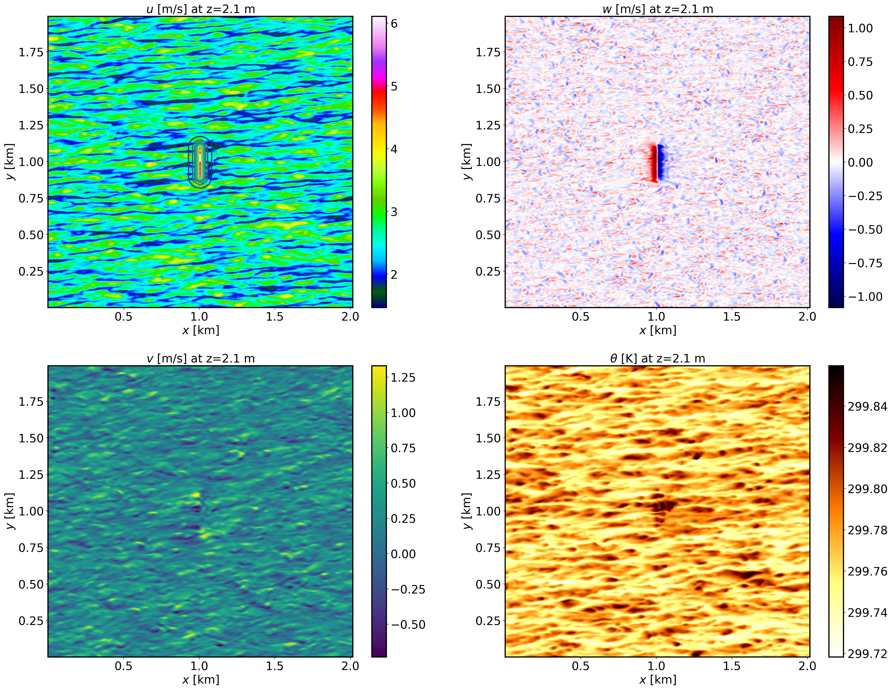
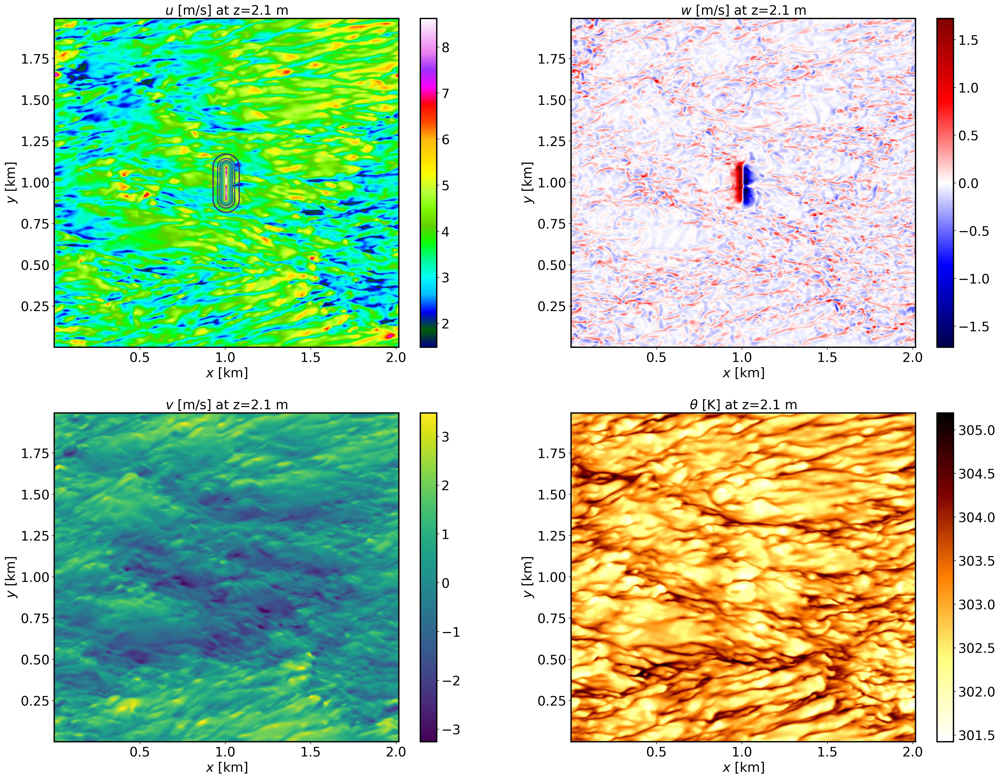
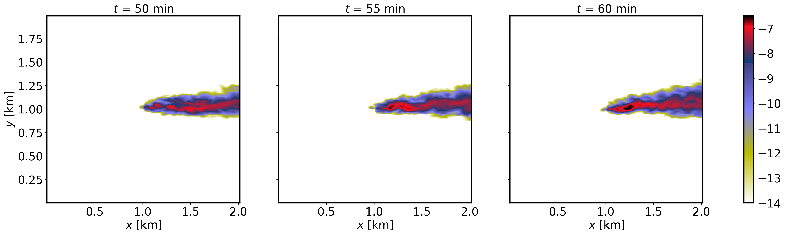
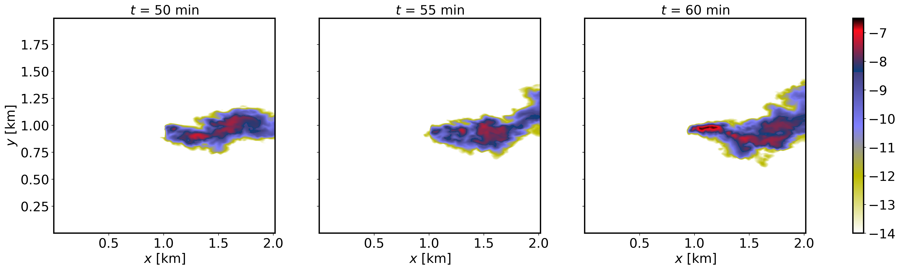
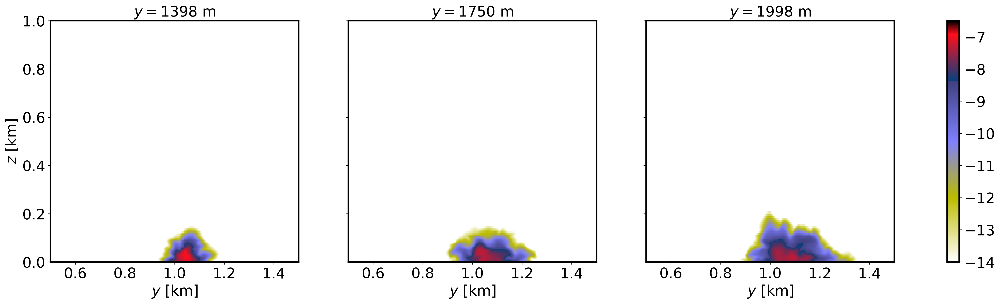
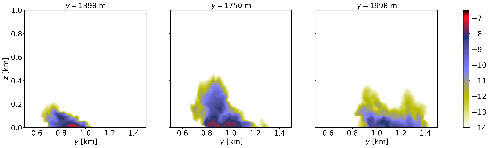

==============================================================
Passive scalar transport and dispersion over an idealized hill
==============================================================

Background
----------

This is an example of transport and dispersion of a scalar in the presence of idealized topography. The idealized terrain is based on the Witch of Agnesi, and a passive tracer is released on the lee side of the hill.

Input parameters
----------------

* Number of grid points: :math:`[N_x,N_y,N_z]=[504,498,90]`
* Isotropic grid spacings in the horizontal directions: :math:`[\Delta x,\Delta y]=[4,4]` m, the minimum vertical grid at the surface is :math:`\Delta z=3.6` m and stretched with verticalDeformFactor :math:`=0.26`
* Domain size: :math:`[2.16 \times 1.99 \times 1.44]` km
* Model time step: :math:`0.01` s
* Advection scheme: 5th-order upwind
* Time scheme: 3rd-order Runge Kutta
* Geostrophic wind: :math:`[U_g,V_g]=[8,0]` m/s
* Latitude: :math:`54.0^{\circ}` N
* Surface potential temperature: :math:`300` K
* Potential temperature profile:

.. math::
  \partial{\theta}/\partial z =
    \begin{cases}
      0 & \text{if $z$ $\le$ 500 m}\\
      0.003 & \text{if $z$ > 500 m}
    \end{cases} 

* Rayleigh damping layer: uppermost :math:`600` m of the domain
* Initial perturbations: :math:`\pm 0.25` K 
* Depth of perturbations: :math:`375` m
* Top boundary condition: free slip
* Lateral boundary conditions: periodic
* Time period: :math:`1` h

Execute FastEddy
----------------

See :ref:`run_fasteddy` for general instructions on how to build and run FastEddy on NSF NCAR's High Performance Computing machines.

Note that this example requires creation of a terrain and source specification files. Follow the sequence of steps below.

1. Execute the Jupyter notebook provided in **tutorials/notebooks/Dispersion_PrepTerrain.ipynb** to create the topography file *Topography_504x498.dat* that corresponds to a Witch of Agnesi hill of 15 m height.
2. Execute the Jupyter notebook provided in **/tutorial/notebooks/Dispersion_PrepAuxSrc.ipynb** to create the source specification input file. This example will add two sources at the first vertical grid levels upstream (*x* = 930 m) and downstream (*x* = 1082 m) of the hill. The emissions begin :math:`45` min into the simulation.

Two FastEddy simulation setups are provided for this tutorial, corresponding to weakly stable (*Example07_DISPERSION_SBL.in*) and convective conditions (*Example07_DISPERSION_CBL.in*). The terrain preparation and source input file steps only need to be carried out once.

Visualize the output
--------------------

1. Open the Jupyter notebook entitled *MAKE_FE_TUTORIAL_PLOTS.ipynb*.
2. Under the "Define parameters" section, modify :code:`path_base`, specifying the full path to the **Example07_DISPERSION_SBL** subdirectory, but don't include **Example07_DISPERSION_SBL** subdirectory. Be sure to include a trailing slash :code:`/`).
3. Under the "Define parameters" section, modify :code:`case` to set its value to :code:`dispersion`.
4. Run the Jupyter notebook.
5. The resulting XY cross section png plots will be placed in a **FIGS** subdirectory of the **Example07_DISPERSION_SBL** directory.

XY-plane views of instantaneous velocity components and potential temperature for the SBL case at :math:`t=1` h (FE_DISPERSION.360000). The contour lines in the :math:`u` panel display terrain elevation:

XY-plane views of instantaneous velocity components and potential temperature for the CBL case at :math:`t=1` h (FE_DISPERSION.360000). The contour lines in the :math:`u` panel display terrain elevation:

XY-plane views of instantaneous plume dispersion for the SBL case at :math:`z=30` m AGL and different times (:math:`t=50,55,60` min), corresponding to the windward release:

XY-plane views of instantaneous plume dispersion for the CBL case at :math:`z=30` m AGL and different times (:math:`t=50,55,60` min), corresponding to the windward release:

YZ-plane views of instantaneous plume dispersion for the SBL case at several downstream distances (:math:`t=1` h, FE_DISPERSION.360000), corresponding to the windward release:

YZ-plane views of instantaneous plume dispersion for the CBL case at several downstream distances (:math:`t=1` h, FE_DISPERSION.360000), corresponding to the windward release:

Analyze the output
------------------

* How does the terrain impact gets altered by the different stability conditions?
* What are the differences in plume dispersion between stable and convective condtions?
* How does downstream distance affect structure of the plume?
