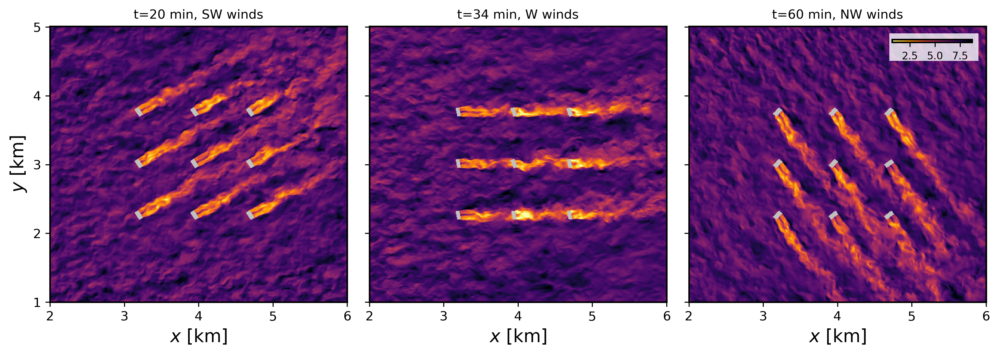

=====================================
Turbine array flow with the GAD model
=====================================

This is an idealized scenario of wind farm (3 x 3 turbine array) flow in neutrally stratified boundary layer with an evolving wind direction spanning 90 degrees of clockwise turning over 40 minutes. This idealized scenario demonstrates the generalized actuator disk (GAD) implementation in FastEddy (*Sanchez Gomez et al., 2024*), with the inclusion of a turbine yawing capability to align with the meteorological wind direction at the turbine's nacelle. The initial and boundary conditions for this idealized case are derived from a horizontally averaged LES run of a neutral ABL with a geostrophic wind aligned in the zonal direction (:math:`[U_g,V_g]=[10.0,0.0]` m/s) with and a latitude of :math:`40.0^{\circ}` N. The required datasets to run this tutorial are provided at this `Zenodo record <https://zenodo.org/records/19462617>`_.

The GAD model is activated by the selector (:code:`GADSelector = 1`) in the parameters file. This case uses the parameters file **tutorials/examples/Example09_GAD.in**. The lines below correspond to additions to the FastEddy parameters file necessary for turbine-inclusive LES runs. These correspond to the turbine specification file (:code:`turbineSpecsFile`) and a parameter to choose whether or not to write GAD forces to output files (:code:`GADoutputForces`).

.. code-block:: none

   #--GAD
   GADSelector = 1
   turbineSpecsFile = ./GAD_NREL28_9WTs_tutorial.nc
   GADoutputForces = 1

A key aspect required for the GAD model to work is the specification of the aerodynamic characteristics of the simulated turbine. The turbine specifications file is a netCDF formatted file that provides the aerodynamic characteristics alongside the geometric characteristics of the wind turbine (rotor diameter: :code:`GAD_rotorD`, turbine hub height: :code:`GAD_hubHeights`, nacelle diameter: :code:`GAD_nacelleD`). The turbine specifications file also informs the location and initial orientation of the turbines (:code:`GAD_Xcoords`, :code:`GAD_Ycoords`, :code:`GAD_rotorTheta`). Aerodynamic characteristics are given as polynomial fits for lift and drag coefficient, twist, chord length, blade pitch, and rotational speed discretized over a finite number of normalized blade elements (:code:`rnorm_vect`), following the blade-element momentum theory used in the GAD formulation. For flexibility purposes, an arbitrary number of turbines (:code:`GAD_turbineType`) can be defined. This tutorial provides an example turbine specification file corresponding to the U.S. Department of Energy NREL28 turbine (**GAD_NREL28_9WTs_tutorial.nc**). All the required variables and dimensions in the turbine specifications file are listed here below.

.. code-block:: none

   float GAD_Xcoords(GADNumTurbines) ;
   float GAD_Ycoords(GADNumTurbines) ;
   float GAD_rotorTheta(GADNumTurbines) ;
   int GAD_turbineType(GADNumTurbines) ;
   int GADNumTurbineTypes(GADNumTurbineTypes) ;
   int turbinePolyClCdrNormBounds(turbinePolyClCdrNormBounds) ;
   int turbinePolyClCdrNormSegments(turbinePolyClCdrNormSegments) ;
   int alphaBounds(alphaBounds) ;
   int turbinePolyOrderMax(turbinePolyOrderMax) ;
   float GAD_hubHeights(GADNumTurbineTypes) ;
   float GAD_rotorD(GADNumTurbineTypes) ;
   float GAD_nacelleD(GADNumTurbineTypes) ;
   float rnorm_vect(GADNumTurbineTypes, turbinePolyClCdrNormBounds) ;
   float alpha_minmax_vect(GADNumTurbineTypes, alphaBounds) ;
   float turbinePolyTwist(GADNumTurbineTypes, turbinePolyOrderMax) ;
   float turbinePolyChord(GADNumTurbineTypes, turbinePolyOrderMax) ;
   float turbinePolyPitch(GADNumTurbineTypes, turbinePolyOrderMax) ;
   float turbinePolyOmega(GADNumTurbineTypes, turbinePolyOrderMax) ;
   float turbinePolyCl(GADNumTurbineTypes, turbinePolyClCdrNormSegments, turbinePolyOrderMax) ;
   float turbinePolyCd(GADNumTurbineTypes, turbinePolyClCdrNormSegments, turbinePolyOrderMax) ;
   int turbinePolyTwistOrder(GADNumTurbineTypes) ;
   int turbinePolyChordOrder(GADNumTurbineTypes) ;
   int turbinePolyPitchOrder(GADNumTurbineTypes) ;
   int turbinePolyOmegaOrder(GADNumTurbineTypes) ;
   int turbinePolyClOrder(GADNumTurbineTypes) ;
   int turbinePolyCdOrder(GADNumTurbineTypes) ;

The GAD turbine model capability has been implemented into FastEddy as an extension module, and is not compiled by default. The user needs to build FastEddy using the following compile flag below in order to include the GAD module:

.. code-block:: none

   make WITH_GAD=1

The figure shows instantaneous contours of hub height (90 m) wind speed (in m/s) spatial distribution at three different times, showcasing the yawing of the turbines to align with the time-varying wind direction throughout the course of the simulation as it shifts from SW to NW. The gray areas represent the location over which GAD forces are applied (larger than the actual rotor area).

.. note::

   * The orientation of the turbine (:code:`GAD_rotorTheta`) is defined as the angle from the negative x axis, increasing counterclockwise. This is different from the meteorological convention for wind direction. For example, a turbine facing the west will have :code:`GAD_rotorTheta` = :math:`0.0^{\circ}`, while a turbine facing south will have :code:`GAD_rotorTheta` = :math:`90.0^{\circ}`.
   * Application of the GAD to a real world WRF-coupled simulation does not require any additional steps besides the ones described here.
   * At this time, users must ensure that the full volume swept by each rotor under all yaw angles is entirely contained within a single MPI rank’s subdomain, avoiding crossing any rank boundaries. In FastEddy v4.0 if this configuration is specified, the model may crash or produce erroneous GAD forcing artifacts. A future FastEddy release will address this corner case scenario.
  

Full citation references can be found in the :doc:`Publications <../../publications>` section.
