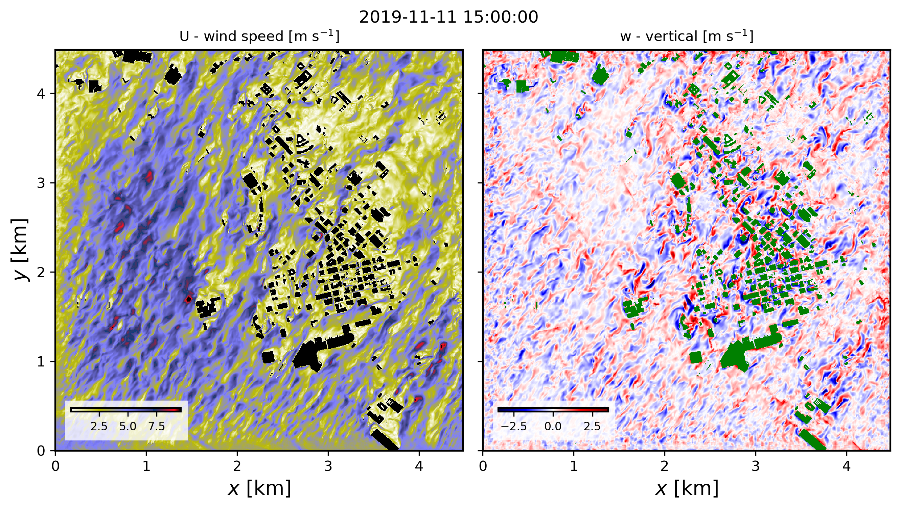

========================================================
Real-world downscaled FastEddy simulation with buildings
========================================================

This tutorial involves setting up a real-world downscaled simulation that includes resolved buildings and closely follows the same procedure outlined in section 4.1. Additional steps for including buildings are described below and all required input datasets to run this tutorial are provided in this `Zenodo record <https://zenodo.org/records/17419234>`_.

In the *GeoSpec* preprocessing step, and additional 2d field describing building heights above ground level is required in the georeference input NetCDF file.

.. code-block:: none

   float BuildingHeights(y, x) ;

This tutorial provides an example georeference input file with building heights for downtown Dallas, TX (:code:`Dallas_input_Oct2025_lod13.nc`). The *geospec.json* parameter file option :code:`urban_opt : 1` needs to be selected for building height information to be ingested in the reference standard-format NetCDF output file upon execution of **GeoSpec.py**.

The same :code:`urban_opt : 1` option needs must be included in the subsequent *SimGrid* and *GenICBCs* stages, where building information is used for the creation of a :code:`BuildingMask` array containing gridded information of building presence, and ensuring that winds, subgrid-scale TKE and hydrometeors are set to zero within buildings for both initial and boundary conditions.

After initial and boundary conditions have been created, a building-resolving FastEddy simulation can be undertaken by activating the urban model capability in the parameters file (see **tutorials/examples/Example10_REALCASE_Dallas_urban.in**).

.. code-block:: none

   #--URBAN
   urbanSelector = 1 # urban selector: 0=off, 1=on

The urban model capability has been implemented into FastEddy as an extension module, and is not compiled by default. To include the URBAN module in a build of FastEddy use the following compile flag:

.. code-block:: none

   make WITH_URBAN=1

The model used to represent buildings follows the immersed body force approach described in *Muñoz-Esparza et al., 2020*, and the tutorial case corresponds to the passage of a cold front (*Muñoz-Esparza et al. (2021, 2025)*. The figure below shows instantaneous wind speed and vertical velocity fields corresponding to 30min hindcast valid at 1500 UTC on November 11th 2019 (pre-frontal conditions). These horizontal contours are from the model's third vertical level, located at approximately 23 m above ground level.

Full citation references can be found in the :doc:`Publications <../../publications>` section.
