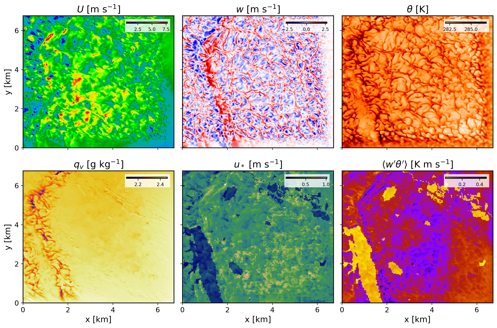

===================================================
Running a real-world downscaled FastEddy simulation
===================================================

After initial and boundary conditions have been created, a FastEddy simulation can undertaken with intial and boundary forcing from the mesoscale prognostic state fields. The lines below correspond to additions and modifications to the FastEddy parameters file necessary for coupled mesoscale-LES runs (corresponding to the test case from **tutorials/examples/Example08_REALCASE_FortCollins.in**)

.. code-block:: none

   #--GRID
   topoFile = ./FortCollinsCO_Topography_448x450.dat
   #--Boundary Conditions Set
   hydroBCs = 1
   ceilingAdvectionBC = 1
   hydroBndysFileBase = ./ICBC/FE_Bndys
   hydroBndysFileStart = 0
   hydroBndysFileEnd = 16
   dtBdyPlaneBCs = 300.0

From the parameters above, :code:`hydroBCs = 1` is the main option to activate the time-dependent limited area domain boundary condition coupling to a mesoscale model. Note that :code:`dtBdyPlaneBCs` is the frequency in seconds for boundary conditions to update and it needs to match the value of *secInc* specified in **genicbcs.json**. See :ref:`run_fasteddy` for instructions on how to build and run FastEddy on NSF NCAR’s High Performance Computing machines.

.. code-block:: none

   #----------: CELL PERTURBATION METHOD ---
   cellpertSelector = 1 
   cellpert_sw2b = 0 
   cellpert_amp = 2.5 
   cellpert_nts = 250 
   cellpert_gppc = 8 
   cellpert_ndbc = 3 
   cellpert_kbottom = 1 
   cellpert_ktop = 40 
   cellpert_tvcp = 1 
   cellpert_eckert = 0.05 
   cellpert_tsfact = 0.333 

In order to instigate the rapid establishment of developed turbulence with minimal distance (fetch) from the smooth mesoscale lateral boundary conditions, the Cell Perturbation (CP) method should be used by setting :code:`cellpertSelector = 1`. Time-varying cell perturbation (TVCP) can be included with :code:`cellpert_tvcp = 1`. TVCP provides an automatic adjustment with time of the initial and otherwise static cell perturbation parameters (amplitude :code:`cellpert_amp`, upper bound on vertical levels over which to apply perturbations :code:`cellpert_ktop`, and perturbation seeding frequency in timesteps :code:`cellpert_nts`) for real-world cases where atmospheric conditions evolve over time. The internal mechanism implemented for determing time-varying adjustments to the CP parameters uses boundary condition mean state profile statistics and boundary layer height estimation, along with heuristic scaling based on a target perturbation Eckert number (:code:`cellpert_eckert`), and a prescribed factor for adjusting refresh time for perturbations (:code:`cellpert_tsfact`). Refer to *Muñoz-Esparza et al.* (2014 [#f1]_, 2015 [#f2]_) for further details.

The figure below shows several instantaneous fields corresponding to a 1h and 25min hindcast valid at 1825 UTC on Februray 16th 2024. These horizontal contours are from the model's second vertical level, located at approximately 25 m above ground level.

.. rubric:: References

.. [#f1] Muñoz-Esparza, D., Kosović, B., Mirocha, J., & van Beeck, J. (2014). Bridging the transition from mesoscale to microscale turbulence in numerical weather prediction models. Boundary-Layer Meteorology, 153(3), 409-440.

.. [#f2] Muñoz-Esparza, D., Kosović, B., van Beeck, J., & Mirocha, J. (2015). A stochastic perturbation method to generate inflow turbulence in large-eddy simulation models: Application to neutrally stratified atmospheric boundary layers. Physics of Fluids, 27(3), 035102.
